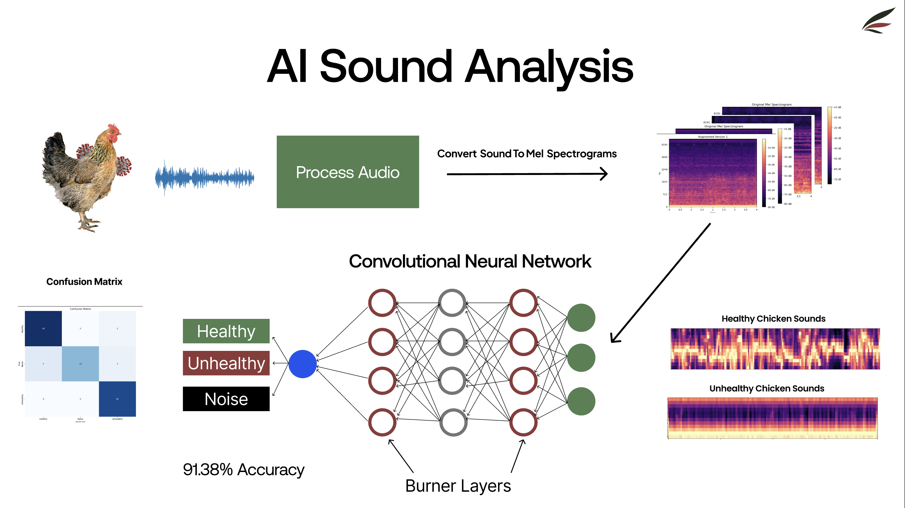
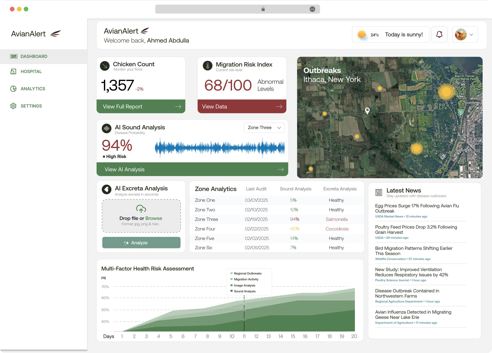

# 🐔 AvianAlert: Early Detection, Immediate Action

> 🏆 **First Prize – Data Science Track**  
> 🏛️ *Cornell Institute for Digital Agriculture Hackathon 2025*

AvianAlert is a real-time AI system that detects poultry diseases early using sound and fecal image analysis.

  

---

## 🎬 Live Demo

  <video src="https://private-user-images.githubusercontent.com/196995749/431199277-ae1ab94e-8540-467f-96c0-c18d7744723d.mp4?jwt=eyJhbGciOiJIUzI1NiIsInR5cCI6IkpXVCJ9.eyJpc3MiOiJnaXRodWIuY29tIiwiYXVkIjoicmF3LmdpdGh1YnVzZXJjb250ZW50LmNvbSIsImtleSI6ImtleTUiLCJleHAiOjE3NDQwODUyNjQsIm5iZiI6MTc0NDA4NDk2NCwicGF0aCI6Ii8xOTY5OTU3NDkvNDMxMTk5Mjc3LWFlMWFiOTRlLTg1NDAtNDY3Zi05NmMwLWMxOGQ3NzQ0NzIzZC5tcDQ_WC1BbXotQWxnb3JpdGhtPUFXUzQtSE1BQy1TSEEyNTYmWC1BbXotQ3JlZGVudGlhbD1BS0lBVkNPRFlMU0E1M1BRSzRaQSUyRjIwMjUwNDA4JTJGdXMtZWFzdC0xJTJGczMlMkZhd3M0X3JlcXVlc3QmWC1BbXotRGF0ZT0yMDI1MDQwOFQwNDAyNDRaJlgtQW16LUV4cGlyZXM9MzAwJlgtQW16LVNpZ25hdHVyZT0wNTM3ZDFiMmZlN2IxZTJiM2U0MzM5MzkxYTM2N2NmYjUxNzc0NmQ3YWZmMTFlYzFkMTQyNjk5ZDc4MWEwODZiJlgtQW16LVNpZ25lZEhlYWRlcnM9aG9zdCJ9.gXRGEpaXzW7mSuxt7DeKjIsgcqFKxGspiM-JMJrLwuc" width="720" height="405" controls></video>

---

## 📊 The Problem

Each year, preventable poultry diseases cause devastating losses:

- 💸 **$600M** in economic damage (last quarter)  
- 🐔 **20M** dead chickens  
- 🥚 **96.4%** egg price increase year-over-year  
- 🌾 **$100M** losses to American farmers

---

## 🧠 Solution Overview

AvianAlert is an AI-driven monitoring tool built on three main components:

### 🔹 Flock Segmentation

- Divides poultry facilities into zones
- Enables localized disease containment

  

---

### 🔹 AI Sound Analysis

- Classifies poultry vocalizations in real time
- Detects early signs of respiratory distress

  

---

### 🔹 AI Excreta Analysis

- Analyzes images of chicken droppings
- Detects diseases like:
  - Salmonella  
  - Newcastle Disease (NCD)  
  - Coccidiosis  
  - Avian Flu

  

---

## 🧪 Technical Architecture

### 🎧 Audio Classification (CNN + Burn Layers)

- Input: Mel spectrograms of vocalizations  
- Classes: Healthy / Unhealthy / Noise  
- Burn Layers ensure noise resilience

**Key Metrics:**
- ✅ Accuracy: 91.38%  
- 🚨 100% sensitivity for unhealthy class  

---

### 🖼️ Image Classification (EfficientNetB0)

- Input: Chicken fecal images (160x160)  
- Model: Transfer learning with EfficientNetB0  
- Output: Multi-class disease prediction  

---

## 💻 Dashboard

Real-time web dashboard shows:

- 🧠 Sound-based health indicators  
- 🧭 Zone-specific outbreak tracking  
- 📈 Risk scoring and migration alerts  
- 🐔 Chicken count heatmaps  

  

---

## 🗣️ Pitch Video

🎥 [Watch Our Hackathon Pitch on YouTube](https://youtu.be/WwGf5H9atKg)

---

## 🌿 Sustainability Impact

- 🌍 **Lower environmental footprint**  
- 🍳 **More stable egg supply**  
- 💼 **Improved farmer livelihoods**

---

## 🛠 Market Readiness

| Feature               | Status            |
|----------------------|-------------------|
| AI Model Training     | ✅ Completed       |
| Real-time Monitoring  | ✅ Supported       |
| Hardware Requirements | ✅ Mic + Phone     |
| Deployment Potential  | 🚀 Field-ready     |

---

## 💰 Financial Overview

| Metric              | Value         |
|---------------------|---------------|
| Cost per Chicken     | $0.08/year    |
| Potential Revenue    | $100M         |
| Global Savings       | $2B           |
| Farm Savings (US)    | $500M         |

---

## 🏆 Awards

- 🥇 **First Prize – Data Science Track**  
  Cornell Digital Agriculture Hackathon 2025

---

## 👥 Team

- **Ahmed Abdulla**  
- **Farhan Mashrur**  
- **Suresh Kamath Bola**  
- **Kiyam Merali**

---

## 📜 License

**Educational Use License**  
This project is provided for educational and non-commercial use.  
Commercial use requires written permission from the authors.
